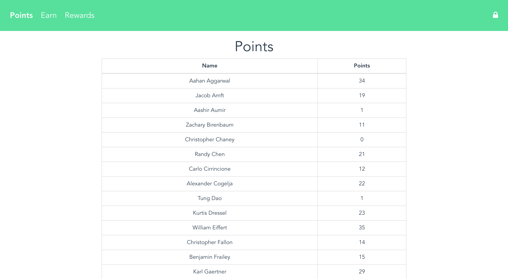

# 5N Points
A simple system to track points, rewards, and ways to earn



## Getting started

1. Clone the repository:

```shell
git clone https://github.com/drewthoennes/5NPoints.git
```

2. Install dependencies for frontend:

``` bash
cd Frontend
npm install
```

3. Build and run the frontend:

``` bash
# run application locally for development
npm run dev

# build and run for production
npm run build
npm start
```

4. Install dependencies for backend:

``` bash
cd Backend
npm install
```

5. Start the server:

``` bash
node main.js
```

## Contributing
If you find a bug, a ticket or a pull request would be greatly appreciated!
